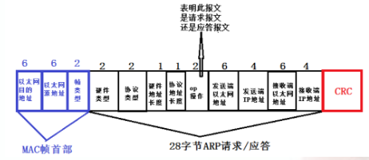

# HashMap

我们知道`Map`是一个` key-val `的集合，`HashMap`是基于`Hash`表的`Map`接口的非同步实现。`HashMap`的基本数据结构是数组和链表。



## HashMap原理

基于`hashing`原理，我们通过`put()`和`get()`方法储存和获取对象。当我们将键值对传递给`put()`方法时，它调用键对象的`hashCode()`方法来计算`hashcode`，返回的`hashCode`用于找到`bucket`位置来储存`Entry`对象。如果该位置已经有元素了,调用`equals`方法判断是否相等,相等的话就进行替换值,不相等的话,放在链表里面.

当获取对象时，通过键对象的`equals()`方法找到正确的键值对，然后返回值对象。`HashMap`使用链表来解决碰撞问题，当发生碰撞了，对象将会储存在链表的下一个节点中。 `HashMap`在每个链表节点中储存键值对对象

## HashMap的存储原理和存储过程

声明一个下标范围比较大的数组来存储元素，另外设计一个哈希函数获得每一个元素的`Key`（关键字）的函数值（即数组下标，`hash`值）相对应，数组存储的元素是一个`Entry`类，这个类有三个数据域，`key`、`value`（键值对），`next`(指向下一个Entry)。 当两个`key`通过哈希函数计算相同时，则发生了`hash`冲突(碰撞)，`HashMap`解决`hash`冲突的方式是用链表。

例如， 第一个键值对`A`进来。通过计算其`key`的`hash`得到的`index=0`。记做:`Entry[0] = A`。 
第二个键值对`B`，通过计算其`index`也等于`0`， `HashMap`会将`B.next =A`,`Entry[0] =B`, 
第三个键值对 `C`,`index`也等于`0`,那么`C.next = B`,`Entry[0] = C`；这样我们发现`index=0`的地方事实上存取了`A`,`B`,`C`三个键值对,它们通过`next`这个属性链接在一起。所以当`hash`冲突很多时，`HashMap`退化成链表。

`put`过程：

- 先判断键值对数组`table[i]` 是否为空否则进行扩容操作`（resize（））`；
- 根据键值`key`计算`hash`值得到插入的数组索引`i`，如果`table[i]==null`，直接新建节点添加到最后一步，如果`table[i]`不为空进行下一步； 
- 判断`table[i]`的首个元素是否和`key`一样，如果相同直接覆盖`value`，否则进行下一步，这里的相同指的是`hashCode`以及`equals`； 
- 判断`table[i]`是否为`treeNode`，即`table[i] `是否是红黑树，如果是红黑树，则直接在树中插入键值对，否则进行下一步； 
- 遍历`table[i]`，判断链表长度是否大于`8`，大于`8`的话把链表转换为红黑树，在红黑树中执行插入操作，否则进行链表的插入操作；遍历过程中若发现`key`已经存在直接覆盖`value`即可； 
- 插入成功后，判断实际存在的键值对数量`size`是否超多了最大容量`threshold`，如果超过，进行扩容。

`get`过程：

- 先通过`key`值进行哈哈希函数的运算得到`hash`值；
- 调用`getNode()`，得到桶号；
- 在桶里面找元素和`key`值相等的即可，未找到返回空。

## HashMap的初始化容量为什么为2的次幂？

因为在`get（）`方法中，获得元素的位置是通过`(length- 1) & h `来得到的，其中` h`:为插入元素的`hashcode length`:为`map`的容量大小。如果`length`为`2`的次幂 则`length-1` 转化为二进制必定是`11111……`的形式，在于h的二进制与操作效率会非常的快，而且空间不浪费。如果是其他的话，空间不够，碰撞的几率变大，查询变慢，空间会浪费。　

## 为什么HashMap是非线程安全的？

首先我们知道为了减少冲突，我们需要时刻留意当前的`size`是否太大，检查是否需要扩容，一旦超过设定的`threshold`，那么就要重新增大数组尺寸，此时所有元素都需要重新计算应该放置的下标。同时`HashMap`在扩容的时候，是通过重新创建一个新的`hash`表，把原来旧数组中的`Entry`一个个迁移到新数组的，注意一点就是计算在`newTable`中的位置，原来在同一条链上的元素可能被分配到不同的位置，看下面的源码。每次会扩容长度为以前的`2`倍，原因看上面。

```java
void transfer(Entry[] newTable) {
        Entry[] src = table;
        int newCapacity = newTable.length;
        //将每条链中的元素迁移过去
        for (int j = 0; j < src.length; j++) {
            Entry<K,V> e = src[j];
            if (e != null) {
                src[j] = null;   
            //遍历第j条链
                do {
                    Entry<K,V> next = e.next;
                    // 计算在newTable中的位置，原来在同一条链上的元素可能被分配到不同的位置
                    int i = indexFor(e.hash, newCapacity);   
                    e.next = newTable[i];
                    newTable[i] = e;
                    e = next;
                } while (e != null);
            }
        }
    }
```

单线程的情况`resize（）`是没有问题的，但是多线程的时候就可能会出现形成环形链表的情况，导致扩容失败。具体详细的图可以看<https://blog.csdn.net/andy_budd/article/details/81413464>

## HashMap和HashTable的区别：

`HashTable` 是不能接受`NULL`，`NULL`值组合的，而`HashMap`可以。（因为`HashMap`做了对应的`NULL`值处理，会把`NULL`值的键值对放到`hashcode `为`0 `的链表里面）。

`HashTable`是线程安全的，`HashMap`是线程非安全的。因为`HashTable`是`synchronized`，要想是`HashMap`线程安全`Map m = Collections.synchronizeMap(hashMap)`.

## HashMap和TreeMap比较
- `HashMap`适用于在`Map`中插入、删除和定位元素。 
- `Treemap`适用于按自然顺序或自定义顺序遍历键`（key）`。 
- `HashMap`通常比`TreeMap`快一点（树和哈希表的数据结构使然），建议多使用`HashMap`,在需要排序的`Map`时候才用`TreeMap`。`TreeMap`的底层是红黑树。
- `HashMap `非线程安全 `TreeMap `非线程安全 
- `HashMap`的结果是没有排序的，而`TreeMap`输出的结果是排好序的。

## 为什么HashMap长度大于8才转换为红黑树，而不是6

红黑树的平均查找长度是`log(n)`，长度为`8`，查找长度为`log(8)=3`，链表的平均查找长度为`n/2`，当长度为`8`时，平均查找长度为`8/2=4`，这才有转换成树的必要；链表长度如果是小于等于`6`，`6/2=3`，虽然速度也很快的，但是转化为树结构和生成树的时间并不会太短。中间有个差值`7`可以防止链表和树之间频繁的转换。

这个只是简单的说法个人感觉，正确的说话应该是理想情况下随机`hashCode`算法下所有`bin`中节点的分布频率会遵循泊松分布，据概率统计决定的。

# CourrentHashMap

`Java 7`中的`ConcurrentHashMap`的底层数据结构仍然是数组和链表。与`HashMap`不同的是，`ConcurrentHashMap`最外层不是一个大的数组，而是一个`Segment`的数组。每个`Segment`包含一个与`HashMap`数据结构差不多的链表数组。整体数据结构如下图所示。


`get`过程

在读写某个`Key`时，先取该`Key`的哈希值。并将哈希值的高`N`位对`Segment`个数取模从而得到该`Key`应该属于哪个`Segment`，接着如同操作`HashMap`一样操作这个`Segment`。为了保证不同的值均匀分布到不同的`Segment`，需要通过如下方法计算哈希值。

`Segment`继承自`ReentrantLock`，使用分段锁的机制。

对于写操作，并不要求同时获取所有`Segment`的锁，因为那样相当于锁住了整个`Map`。它会先获取该`Key-Value`对所在的`Segment`的锁，获取成功后就可以像操作一个普通的`HashMap`一样操作该`Segment`，并保证该Segment的安全性。
同时由于其它`Segment`的锁并未被获取，因此理论上可支持`concurrencyLevel`（等于`Segment`的个数）个线程安全的并发读写。

对于读操作，获取`Key`所在的`Segment`时，需要保证可见性，`ConcurrentHashMap`并没有通过锁或者`volatile`关键字，而是通过以下方式。

```
Segment<K,V> s = (Segment<K,V>)UNSAFE.getObjectVolatile(segments, u)
```

`Java 8`为进一步提高并发性，摒弃了分段锁的方案，而是直接使用一个大的数组。同时为了提高哈希碰撞下的寻址性能，`Java 8`在链表长度超过一定阈值`（8）`时将链表（寻址时间复杂度为`O(N)`）转换为红黑树（寻址时间复杂度为`O(long(N))）`。其数据结构如下图所示：


这个版本，是通过大量的`volatile`关键字以及`CAS`操作来实现线程安全的。

对于`put`操作，如果`Key`对应的数组元素为`null`，则通过`CAS`操作将其设置为当前值。如果`Key`对应的数组元素（也即链表表头或者树的根元素）不为`null`，则对该元素使用`synchronized`关键字申请锁，然后进行操作。如果该`put`操作使得当前链表长度超过一定阈值，则将该链表转换为树，从而提高寻址效率。

对于读操作，由于数组被`volatile`关键字修饰，因此不用担心数组的可见性问题。同时每个元素是一个`Node`实例（`Java 7`中每个元素是一个`HashEntry`），它的`Key`值和`hash`值都由`final`修饰，不可变更，无须关心它们被修改后的可见性问题。而其`Value`及对下一个元素的引用由`volatile`修饰，可见性也有保障。