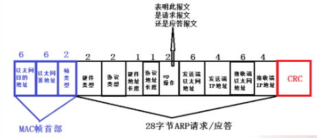

# SpringBoot的IOC和AOP

## IOC

它是一个容器的感觉,听过最多的一个词：控制反转，它表示让容器管理对象，不用每次都自己取`new`对象。使用`@Service`和`@Autowired`提供和使用服务。`spring` 是一种基于`IOC`容器编程的框架。 `spring` 把每一个需要管理的对象称为`spring bean`，`spring`管理这些`bean` 被我们称之为`spring ioc `容器。`IOC`容器具备两个基本功能：

- 通过描述管理（发布，获取）`bean`

- 通过描述完成 `bean`之间的依赖关系

一个对象的实例和字段的值被一个特殊的对象从外部注入，这个特殊的对象就是`IOC`。

`IOC`容器包含了所有的`Spring Beans`。

由此我们可以看书`IOC`的目的无外乎三种：

- `Resource`定位，也就我们所说的配置文件（`Xml`），配置类（`JavaConfig`）。必须先找到描述`bean`对象的文件，才好完成后面对象创建与管理。
- `BeanDefinition`的解析和注册，承继上面的找到`bean`对象描述信息之后，我们需要在内存中用命为`BeanDefinition`的对象去封装它。何谓注册？顾名思义，注册就是为了后面的查询服务的，我们前文不是提及过希望有一个“容器”去管理它们吗。所以注册就是以`beanName` 为`key`，`beanDefinition`为`value`注册到一个`concurrentHashMap`中去。
- `Ioc`的依赖注入，通过`getbean()`的方式获取bean对象，而依赖注入就是在这个方法内部完成的，内部是以递归的方式完成的。所以当我们在开发时候碰到空指针异常的时候，大多数时候是因为我们`Spring` 配置文件处理不当，`bean`与`bean`之间的依赖关系没处理好。

那么我们平时初始化的时候做的事情：

- 初始化一个`beanfactory`，`beanfactory`是一个接口，主要是实现`getbean()`方法和维护一个`concurrentHashMap`
- 将上一步生成的`beanfactory`让`beanDefinitionReader`来回调，因为`Reader`类封装完`bean`要扔到我们的`concurrentHashMap`中。
- 完成bean的注册和解析，既然有`spring.xml`的路径，那我就可以获取该文件的文件流，解析其中的标签，然后用`beanDefinition`对象封装，最后扔到`beanfactory`的`concurrentHashMap`中。

那么`beanDefinition`是干啥的呢：


以上完成了`beanDefinition`的解析和注册，下面我们来看看它是如何完成依赖注入的，上文已经解释过`bean`的实例化和依赖注入是在`getBean()`的过程中完成的。


## AOP

切面监控，面向切面编程，可以监控任何文件，目前普遍用于日志。这是基本的，它是基于代理模式实现的。


这张图反映了参与到`AOP`过程中的几个关键组件(以`@Before Advice`为例)：

- 调用者`Beans `- 即调用发起者，它只知道目标方法所在`Bean`，并不清楚代理以及`Advice`的存在
- 目标方法所在`Bean` - 被调用的目标方法
- 生成的代理 - 由`Spring AOP`为目标方法所在`Bean`生成的一个代理对象
- `Advice` - 切面的执行逻辑

### 代理模式

定义：为其他对象提供一种代理以控制对这个对象的访问。这段话比较官方，但我更倾向于用自己的语言理解：比如`A`对象要做一件事情，在没有代理前，自己来做，在对`A`代理后，由`A`的代理类`B`来做。代理其实是在原实例前后加了一层处理，这也是`AOP`的初级轮廓。

代理的话又分为：

- 静态代理模式：静态代理说白了就是在程序运行前就已经存在代理类的字节码文件，代理类和原始类的关系在运行前就已经确定，保证了业务类只需关注逻辑本身，但是如果要代理的方法很多，代码就很复杂了。
- 动态代理模式:动态代理类的源码是在程序运行期间通过`JVM`反射等机制动态生成，代理类和委托类的关系是运行时才确定的。

### 动态代理又有两种方法：

- 使用`jdk`生成的动态代理的前提是目标类必须有实现的接口。但这里又引入一个问题,如果某个类没有实现接口,就不能使用`jdk`动态代理。
- `Cglib`是以动态生成的子类继承目标的方式实现，在运行期动态的在内存中构建一个子类，`Cglib`使用的前提是目标类不能为`final`修饰。因为`final`修饰的类不能被继承。

我们在使用`Spring AOP`的时候，一般是不需要选择具体的实现方式的。`Spring AOP`能根据上下文环境帮助我们选择一种合适的。但是也不是每次都能很正确的选择出来，比方说定义了一个接口，这个接口中并没有定义任何方法，这个时候利用`jdk`创建代理对象就会有问题需要强制使用`CGLIB`来避免这个问题

```java
// 向@EnableAspectJAutoProxy注解中添加属性proxyTargetClass = true即可。 
@Configuration
@EnableAspectJAutoProxy(proxyTargetClass = true)
@ComponentScan(basePackages = "com.destiny1020")
public class CommonConfiguration {}
```

### Spring生成代理对象

`Spring`如何使用`JDK`来生成代理对象，具体的生成代码放在`JdkDynamicAopProxy`这个类中，具体步骤

- 获取代理类要实现的接口,除了`Advised`对象中配置的,还会加上`SpringProxy, Advised(opaque=false) `

- 检查上面得到的接口中有没有定义` equals`或者`hashcode`的接口 

- 调用`Proxy.newProxyInstance`创建代理对象 

  对象生成后：`InvocationHandler`是JDK动态代理的核心，生成的代理对象的方法调用都会委托到`InvocationHandler.invoke()`方法，通过这个方法织入切面

`Spring`如何使用`CGLIB`来生成代理对象：通过动态地对目标对象进行子类化

# 注解的作用

## @SpringBootApplication

表示这是一个配置文件，点击进去可以看到这些配置文件

```java
@Target(ElementType.TYPE)
@Retention(RetentionPolicy.RUNTIME)
@Documented
@Inherited
@SpringBootConfiguration //配置文件
@EnableAutoConfiguration //自动配置
@ComponentScan(excludeFilters = { @Filter(type = FilterType.CUSTOM, classes = TypeExcludeFilter.class),
		@Filter(type = FilterType.CUSTOM, classes = AutoConfigurationExcludeFilter.class) })// 组件扫描，扫描配置类和子包下的bean
```

## @SpringBootTest配合@ContextConfiguration(classes = CommunityApplication.class)

引入的一个用于测试的注解

## @Component

泛指组件，把普通`pojo`实例化到`spring`容器中，相当于配置文件中的  `<bean id="" class=""/>`。

因为在持久层、业务层和控制层中，分别采用`@Repository`、`@Service`和`@Controller`对分层中的类进行凝视，而用`@Component`对那些比较中立的类进行凝视。

## @Controller

用于标注控制层，相当于`struts`中的`action`层

## @Autowired

用来做依赖注入的，直接生成就不用`new`对象了。

## 	@Service

用于标注服务层，主要用来进行业务的逻辑处理

### @PostConstruct

修饰的方法在构造器之后被调用

### @PreDestroy

修饰的方法在销毁之前调用，释放某些资源

## @Repository

用于标注数据访问层，也可以说用于标注数据访问组件，即`DAO`组件.

## @Configuration

`@Configuration`定义配置类，被注解的类内部包含有一个或多个被`@Bean`注解的方法,这些方法将会被`AnnotationConfigApplicationContext`或`AnnotationConfigWebApplicationContext`类进行扫描，并用于构建`bean`定义，初始化`Spring`容器。

## @Bean

`@Bean`注解注册`bean`,同时可以指定初始化和销毁方法

## @Scope("prototype")

这个注解导致每次调用`getbean`方法时都实例化`bean`，但是实际上很少会这样去做。记住被`Spring`容器管理的`Bean`只被实例化一次，因为它是单例的。

# 哪些bean会被扫描

被`@controller` 、`@service`、`@repository` 、`@component `注解的类，都会把这些类纳入进`spring`容器中进行管理

# Spring容器管理Bean

容器实现了`IOC`，

`Bean`的实例化；`Bean`的命名；`Bean`的作用域；`Bean`的生命周期回调；`Bean`延迟实例化；指定`Bean`依赖关系。

## Bean的生命周期

`Spring IOC`容器对`Bean`的生命周期进行管理的过程如下：

- 通过构造器或工厂方法创建`Bean`实例
- 为`Bean`的属性设置值和对其它`Bean`的引用
- 调用`Bean`的初始化方法
- `Bean`可以使用了
- 当容器关闭时，调用`Bean`的销毁方法

# Spring Boot 需要独立的容器运行吗？

可以不需要，内置了 `Tomcat/ Jetty `等容器。

# Spring事务管理

具体的事务的概念可以看[https://xiaorui2.github.io/2019/06/29/%E6%95%B0%E6%8D%AE%E5%BA%93%E4%BA%8B%E5%8A%A1%E5%92%8C%E9%9A%94%E7%A6%BB%E7%BA%A7%E5%88%AB/](https://xiaorui2.github.io/2019/06/29/数据库事务和隔离级别/)

`Spring`事务支持编程式事务管理和声明式事务管理两种。

## Spring事务管理接口

- `PlatformTransactionManager`：（平台）事务管理器
- `TransactionDefinition`：事务定义信息(事务隔离级别、传播行为、超时、只读、回滚规则)
- `TransactionStatus`：事务运行状态

### PlatformTransactionManager

`TransactionTemplate`或者直接使用底层的`PlatformTransactionManager`。对于编程式事务管理，`spring`推荐使用`TransactionTemplate`。`Spring`并不直接管理事务，而是提供了多种事务管理器，通过`PlatformTransactionManager`接口来实现。`PlatformTransactionManager`接口中定义了三个方法：

```java
Public interface PlatformTransactionManager()...{  
    // Return a currently active transaction or create a new one, according to the specified propagation behavior（根据指定的传播行为，返回当前活动的事务或创建一个新事务。）
    TransactionStatus getTransaction(TransactionDefinition definition) throws TransactionException; 
    // Commit the given transaction, with regard to its status（使用事务目前的状态提交事务）
    Void commit(TransactionStatus status) throws TransactionException;  
    // Perform a rollback of the given transaction（对执行的事务进行回滚）
    Void rollback(TransactionStatus status) throws TransactionException;  
} 
```

事务管理器接口`PlatformTransactionManager`通过`getTransaction(TransactionDefinition definition)`方法来得到一个事务，这个方法里面的参数是 `TransactionDefinition`类，这个类就定义了一些基本的事务属性（事务的一些基本配置，描述了事务策略如何应用到方法上）。

事务属性包含了5个方面：



### TransactionDefinition

`TransactionDefinition`中定义了`5`个方法以及一些表示事务属性的常量比如隔离级别、传播行为等等的常量。

```java
public interface TransactionDefinition {
    // 返回事务的传播行为
    int getPropagationBehavior(); 
    // 返回事务的隔离级别，事务管理器根据它来控制另外一个事务可以看到本事务内的哪些数据
    int getIsolationLevel(); 
    // 返回事务必须在多少秒内完成
    //返回事务的名字
    String getName()；
    int getTimeout();  
    // 返回是否优化为只读事务。
    boolean isReadOnly();
} 
```

`TransactionDefinition `接口中定义了五个表示隔离级别的常量：

- `TransactionDefinition.ISOLATION_DEFAULT`:	使用后端数据库默认的隔离级别，`Mysq` 默认采用的 `REPEATABLE_READ`隔离级别 `Oracle` 默认采用的 `READ_COMMITTED`隔离级别.
- `TransactionDefinition.ISOLATION_READ_UNCOMMITTED`: 最低的隔离级别，允许读取尚未提交的数据变更，可能会导致脏读、幻读或不可重复读。
- `TransactionDefinition.ISOLATION_READ_COMMITTED`：允许读取并发事务已经提交的数据，可以阻止脏读，但是幻读或不可重复读仍有可能发生
- `TransactionDefinition.ISOLATION_REPEATABLE_READ`:	对同一字段的多次读取结果都是一致的，除非数据是被本身事务自己所修改，可以阻止脏读和不可重复读，但幻读仍有可能发生。
- `TransactionDefinition.ISOLATION_SERIALIZABLE:` 	最高的隔离级别，完全服从`ACID`的隔离级别。所有的事务依次逐个执行，这样事务之间就完全不可能产生干扰，也就是说，该级别可以防止脏读、不可重复读以及幻读。

在`TransactionDefinition`定义中包括了如下几个表示传播行为的常量：

支持当前事务的情况：

- `TransactionDefinition.PROPAGATION_REQUIRED`： 如果当前存在事务，则加入该事务；如果当前没有事务，则创建一个新的事务。
- `TransactionDefinition.PROPAGATION_SUPPORTS`： 如果当前存在事务，则加入该事务；如果当前没有事务，则以非事务的方式继续运行。
- `TransactionDefinition.PROPAGATION_MANDATORY`： 如果当前存在事务，则加入该事务；如果当前没有事务，则抛出异常。（`mandatory`：强制性）

不支持当前事务的情况：

- `TransactionDefinition.PROPAGATION_REQUIRES_NEW`：创建一个新的事务，如果当前存在事务，则把当前事务挂起。
- `TransactionDefinition.PROPAGATION_NOT_SUPPORTED`： 以非事务方式运行，如果当前存在事务，则把当前事务挂起。
- `TransactionDefinition.PROPAGATION_NEVER`：以非事务方式运行，如果当前存在事务，则抛出异常。

其他情况：

- `TransactionDefinition.PROPAGATION_NESTED`：如果当前存在事务，则创建一个事务作为当前事务的嵌套事务来运行；如果当前没有事务，则该取值等价于`TransactionDefinition.PROPAGATION_REQUIRED`。

#### 事务超时属性(一个事务允许执行的最长时间)

所谓事务超时，就是指一个事务所允许执行的最长时间，如果超过该时间限制但事务还没有完成，则自动回滚事务。在` TransactionDefinition` 中以` int `的值来表示超时时间，其单位是秒。

#### 事务只读属性

事务的只读属性是指，对事务性资源进行只读操作或者是读写操作。所谓事务性资源就是指那些被事务管理的资源。如果确定只对事务性资源进行只读操作，那么我们可以将事务标志为只读的，以提高事务处理的性能。在 `TransactionDefinition` 中以` boolean `类型来表示该事务是否只读。

### TransactionStatus

它用来记录事务的状态 该接口定义了一组方法,用来获取或判断事务的相应状态信息.

## 实现方式

`Spring`提供了对编程式事务和声明式事务的支持，编程式事务允许用户在代码中精确定义事务的边界，而声明式事务（基于`AOP`）有助于用户将操作与事务规则进行解耦。

### 编程式事务

`Spring`提供两种方式的编程式事务管理，分别是：使用`TransactionTemplate`和直接使用`PlatformTransactionManager`。

### 声明式事务

不需要通过编程的方式管理事务，这样就不需要在业务逻辑代码中掺杂事务管理的代码，只需在配置文件中做相关的事务规则声明(或通过基于`@Transactional`注解的方式)，便可以将事务规则应用到业务逻辑中。